# Tasktify

A simple task management app built with React, TypeScript, and Vite. The app is built with MUI and uses the Redux Toolkit for state management.

Project is deployed on Netlify and can be accessed [here](https://xira-ai-frontend-test.netlify.app).


## Prerequisites
- Node.js
- npm
- Git

## Installation

1. Clone the repository

```bash
git clone git@github.com:Bucha789/xira-frontend-test.git
```

2. Install the dependencies

```bash
npm install
```

3. Start the development server

```bash
npm run dev
```

## Testing

The app has unit tests for the task slice.

```bash
npm run test
```


## Project Structure
```bash
├── __tests__
│   ├── pages
│   └── store
│       └── slices
├── assets
│   └── fonts
├── components
├── db
├── pages
├── store
│   ├── hooks
│   └── slices
└── utils
```
- `__tests__`: The unit tests for the application.
- `assets`: The assets for the application. I used like this to have a better initial load of the app.
- `components`: The components for the application. I use some kind of flatten structure for the components.
- `db`: We have the dummy tasks here and some readonly values.
- `pages`: This folder contains the pages for the application. Currently, we have only the home page but thinking in the scalability of the app, I created this folder.
- `store`: The store for the application Redux Toolkit is used to manage the state of the application.
- `utils`: The utils for the application. Functions that are used as helpers in the components are stored here. Like sort functions, etc.


## Lighthouse Results (Tested on the deployed app)
### Desktop
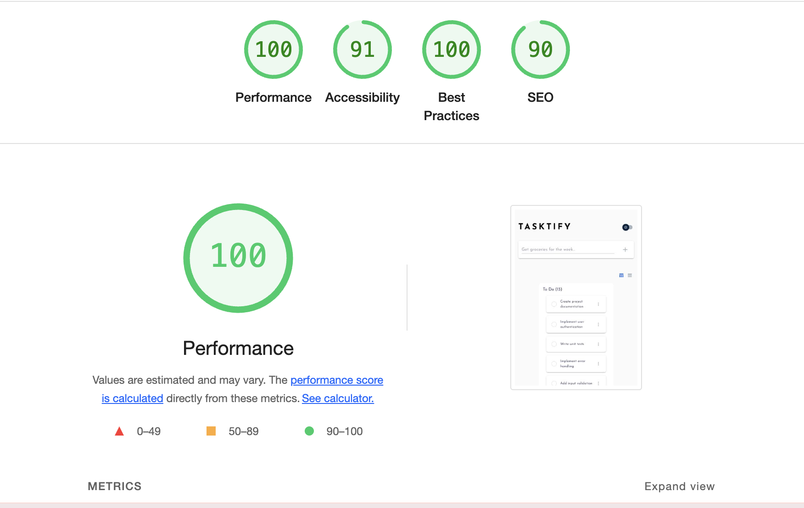
### Mobile
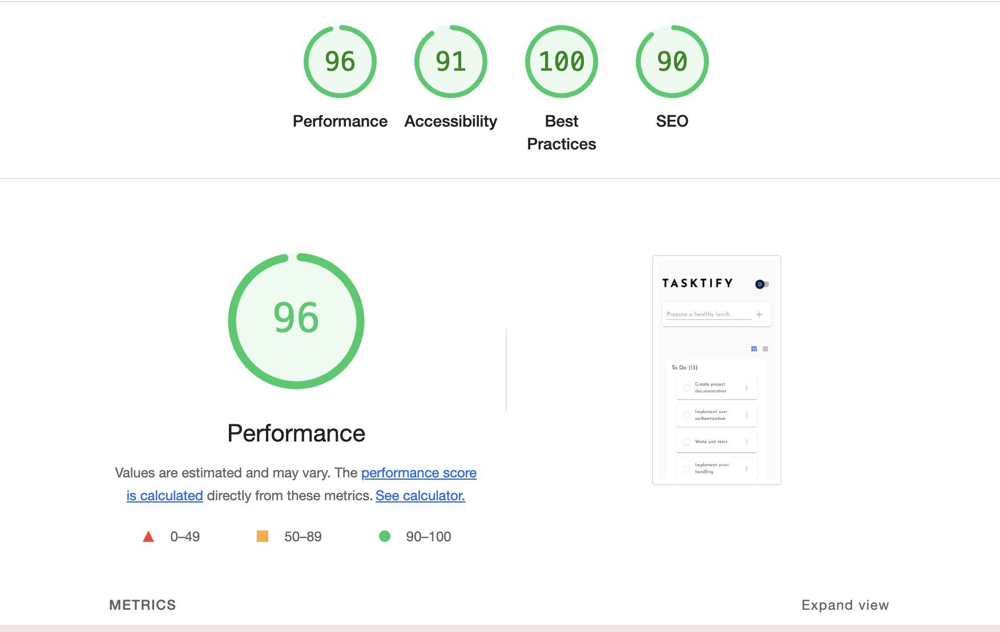

## Features

- **Responsive design**: Thanks to MUI, the app is responsive and works on all devices.
- **Drag and drop tasks**: The app uses the native HTML5 drag and drop API to move tasks between columns.
- **Redux Toolkit**: The app uses the Redux Toolkit for state management.
- **Dark mode**: The app has a dark mode toggle.

## Design

When I was designing the app, I wanted to create a simple and clean design that is easy to use and navigate. I also wanted to make the app look modern and clean. So, I checked some task management apps and I liked the design of [Kanban](https://kanban.so) and [Trello](https://trello.com). 

This approach was very helpful to create the app. So, I followed the requirements rules about to use a list to display the tasks and the drag and drop functionality to move the tasks between columns used the inspiration from the designs of the apps mentioned above and I created the app.

Also, I wanted to keep a seamless user experience, so I added some animations to the app, like the drag and drop animations and the task item animations.

About the dark mode and light mode, I changed the colors of the MUI theme because, in my opinion, the default colors are not very good for the dark mode. I looked for a color palette in the internet and I found a very good one in this figma design from frontend mentor [here](https://www.frontendmentor.io/challenges/todo-app-Su1_KokOW). I used the font from there as well.

Animations are not perfect, but I tried to make them as smooth as possible. It was the first time that I used frame motion so I checked the documentation and I watched some tutorials to understand how to use it. You can find some of them [here](https://youtu.be/O5lZqqy7VQE?si=pzeuqTFhf7RaLbss) and [here](https://youtu.be/UEzt1vp2p6k?si=eklL2DDtqVWNcIGr). Some of the functionalities like the add task button was found there.

I'm not a designer, so I did my best to create a simple and clean design that is easy to use and navigate. I'm open to feedback and suggestions to improve the app. 

It's true that I have worked in a similar app before, but I wanted to create a new one to show my skills and to have a fresh start. (You can find the repo [here](https://github.com/Bucha789/test-task-project)). That's why I didn't use the same design and I created a new one.


For the app, I created two main views:
- **Task board**: The app has a task board with three columns: To Do, In Progress and Done.
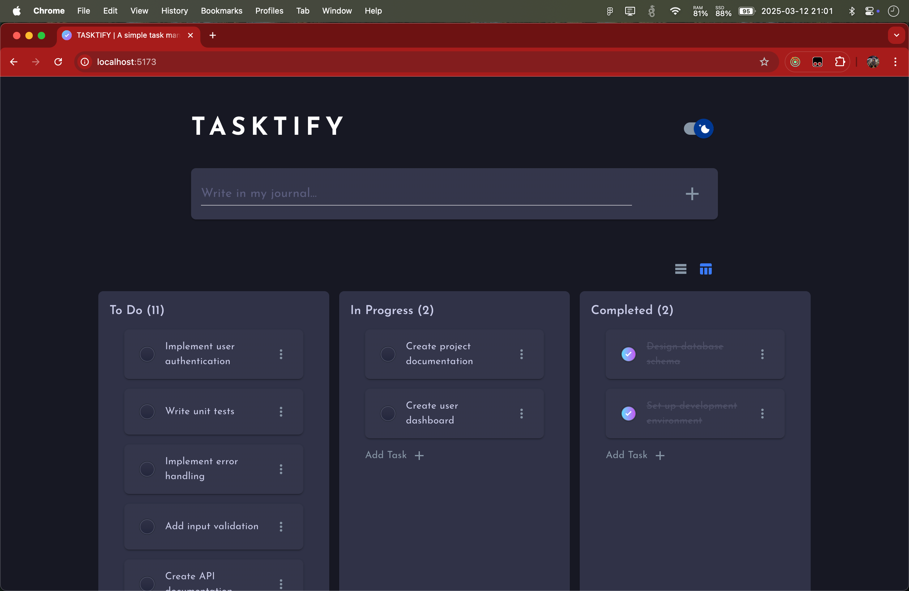
- **Task list**: The app has a task list view that displays all the tasks in a list.
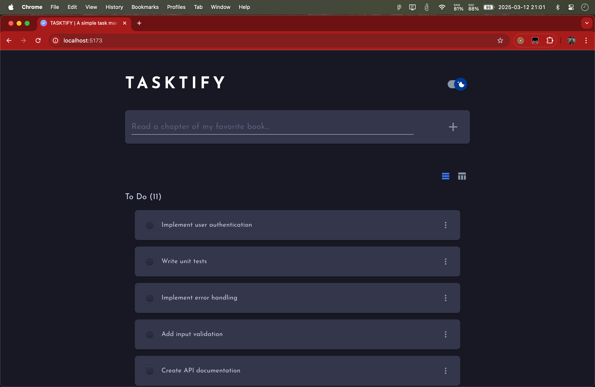

Also, the app has drag and drop functionality for the tasks management.
- Drag and drop tasks between columns.
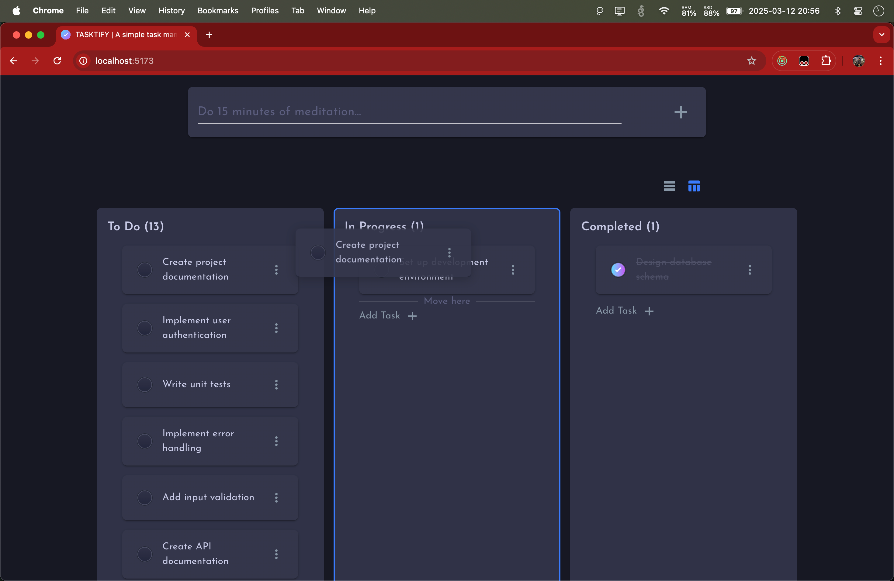
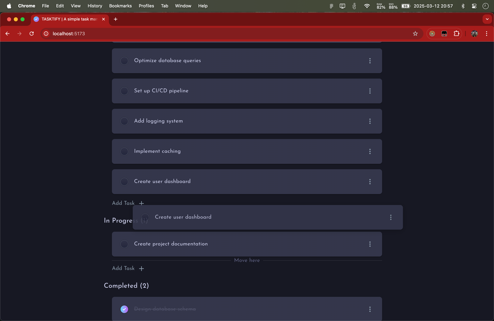
- Drag and drop tasks to delete them.
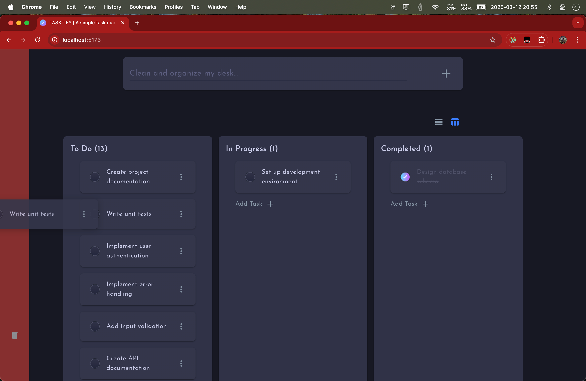
- Clicking on a task, the task can be edited.
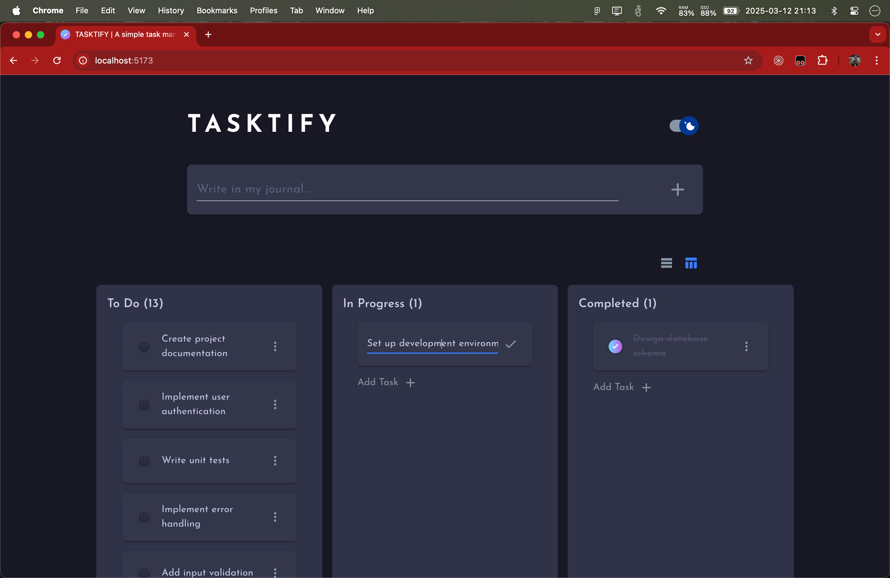

If you don't want to use the drag and drop functionality, you can use the buttons in the task item to edit, delete or complete the task.
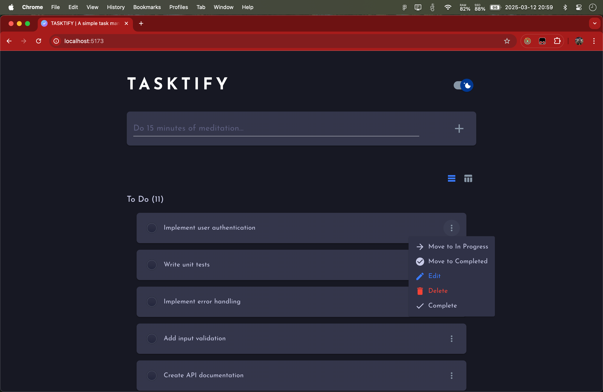

## Dark mode

The app has a dark mode toggle.
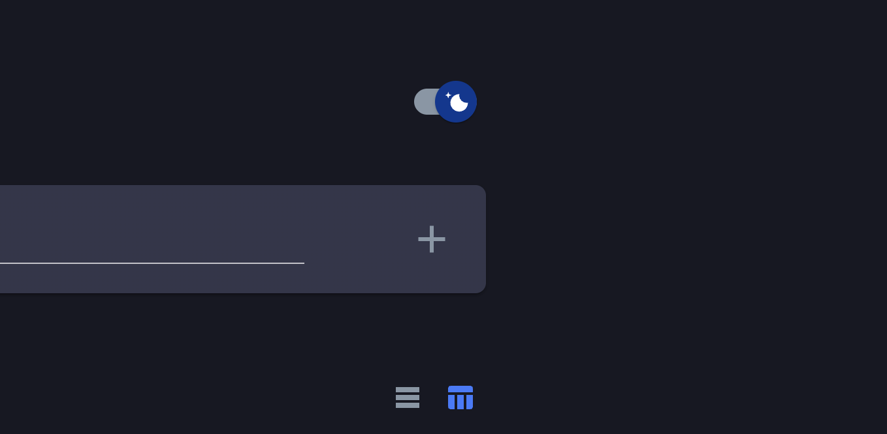

These are the modes available:
- Dark mode
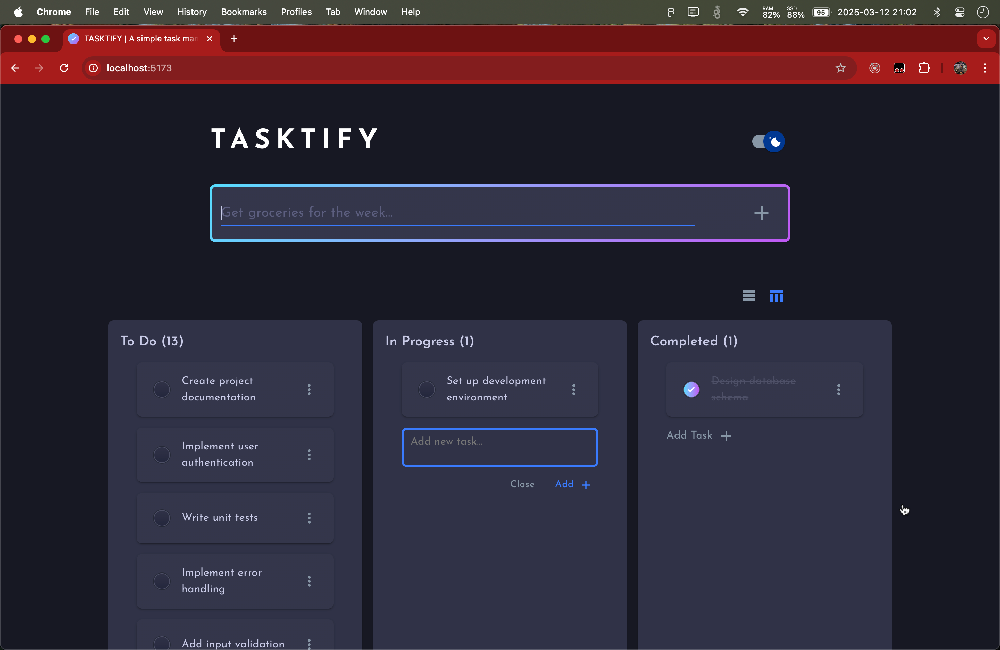
- Light mode
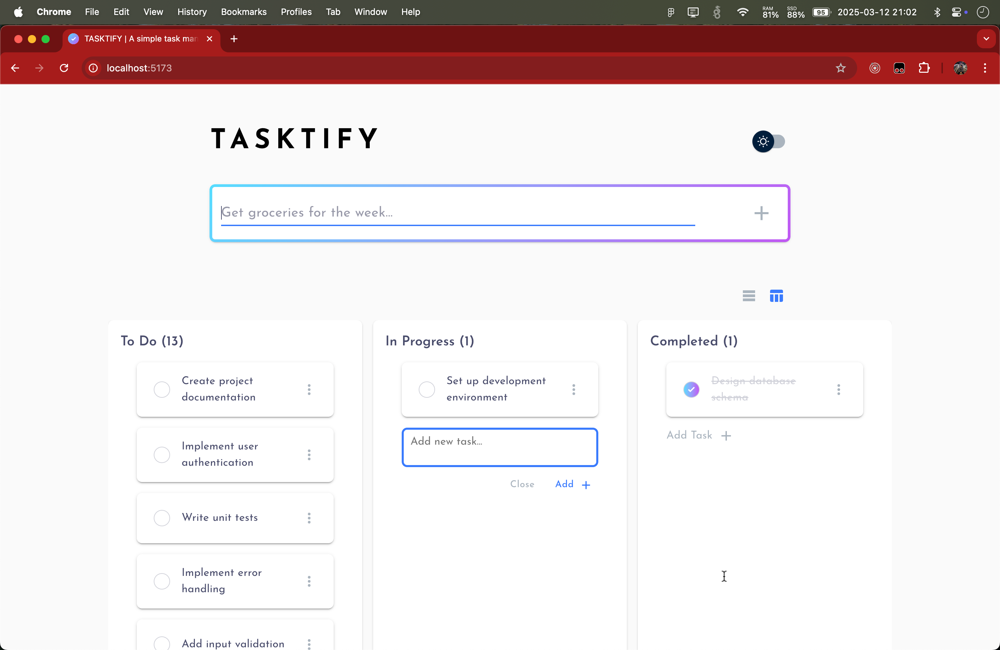


## Videos with the app in action
### Drag and drop

### More Buttons


## Tech Stack
### [Redux Toolkit](https://redux-toolkit.js.org/)
  This library was used to manage the state of the application, tasks and the timer.

### [MUI](https://mui.com/)
  This library was used to create the UI of the application.

### [Vite](https://vitejs.dev/)
  This library was used to create the Vite project.

### [Vitest](https://vitest.dev/)
  This library was used to create the tests for the application.


## Future Improvements
- Add a backend to store the tasks
- Add a login system
- Add a dashboard
- Add a settings page
- Add a help page
- Add a about page
- Improve the UI/UX
- Fix some bugs regarding the animations

## License

This project is licensed under the MIT License. See the [LICENSE](LICENSE) file for details.
